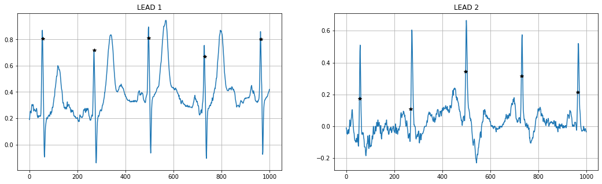
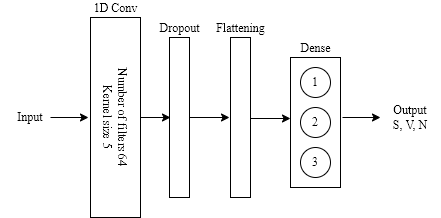
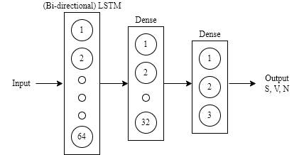
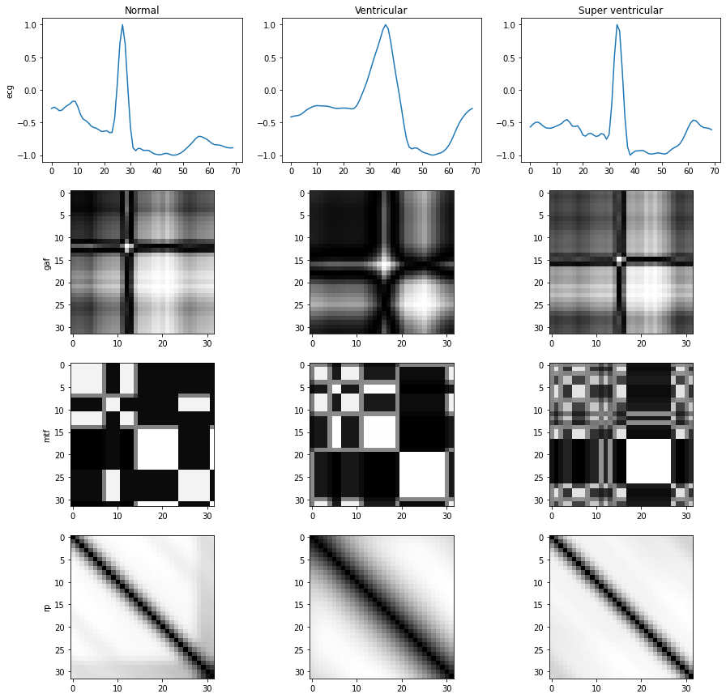
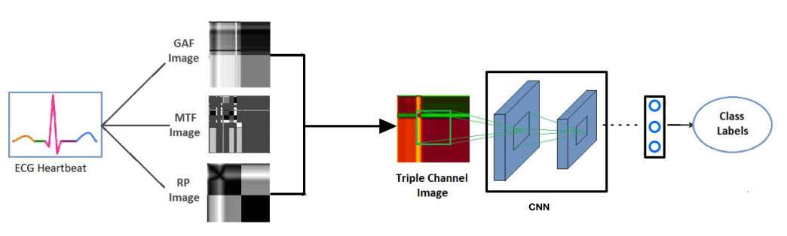

# Heart-Beat-Classification

## Introduction
A heart arrhythmia is an irregular heartbeat that occurs when the electrical signals that coordinate the heart's beats don't work properly. Sometimes this irregularities are considered normal and harmless. However, some heart arrhythmias may cause even life-threatening signs and symptoms. Today's technologies such as wearable products (e.g. Apple Watch) allow us to monitor our heart activity continuously and from home. There is a great possibility that machine learning algorithms could detect abnormal heart beats and even prevent death.
The scope of this assignment was to classify individual heartbeats in a sample ECG signal. It was experimented with two possible approaches - a classic machine learning model with hand-crafted features extracted from the provided samples, and an approach with generated images, fed to an image classifier.

## Dataset and Preprocessing

In the beginning, it was decided to explore the given dataset and perform some basic pre-processing techniques. Each signal from the dataset has three files where one contains the 2-lead ECG signal and the other two are representing the R-peak positions and the beat annotations. The first step in the pre-processing was to downsample the signal with higher sampling frequency, i.e 250 Hz so as to unify all the signals to the same sampling frequency (180 Hz). The second step was to filter the signal keeping only the frequency range between 0.5 and 35 Hz. Since the problem was to label ECG beats, it was decided to split the signals into fixed-size beats, each containing 70 samples i.e. 35 samples before and after the R peak location. The next pre-processing step was to normalize all the beats so that they have the amplitude between -1 and 1. Finally, the dataset contained separated beats and their labels.

  

One of the problems that here was the the unbalanced dataset. Namely, the majority of beats were labeled as normal beat, i.e. classified with the label 'N'. Therefore, the SMOTE technique was used to prevent this, instead of cutting of the huge amount of normal beats. The **SMOTE** is an oversampling technique where the synthetic samples are generated for the minority class. It was decided to do the oversampling so that the new dataset has 100k ventricular (V) and super-ventricular (S) beats, and 300k normal (N) beats. It was applied only to the training data, while the test data remained unchanged so that it correctly represents the original data.

## **Aproach I**

Based on the feature extractions approaches in literature, additional hand-crafted features were added to the data and fed to the classifier. It was suspected that the average HRV, its median and variance, along with average signal amplitude might provide useful information to the model and the first tests confirmed the assumptions. Later, two more features (logarithm of the current and the next RR distance) were added. All of the aforementioned features were then concatenated with the 70-sample beats.

After a thorough investigation of the dataset, models capable of classifying the beats based on the input data we developed. In the first approach, following models were tested: the SVM, Random Forest, AdaBoost, Convolutional Neural Network using 1D convolutional layers, Recurrent Neural Networks using LSTM and Bi-directional LSTM layers, and finally, the ones that produced the best results, LightGBM models. All the model parameters were fine-tuned using GridSearch with a 3-fold cross-validation, which allowed to quickly verify in which direction to move in when developing the classifiers.

### Training

<table><tr>
<td>  </td>
<td>  </td>
</tr></table> 

## **Aproach II**

The main idea is to exploit the state-of-the-art performances of 2D CNN in the classification problem. To transform  each heartbeat in an image several transformations were used. To obtain these 2D matrix picture, three different methodologies were used: Gramian angular field (GAF), Markov transition field (MTF), and recurrence plots (RP). All of these methods were proven to be effective on time series regardless of the specific domain. 

In **GAF**, change of the representation of the signal was done by using the Polar Coordinate system. After normalization, the phase of each value in the time series was calculated. \
In **MTF** an image represents a field of transition probabilities for a discretized time series. It's useful for representing the dynamics of the time series. The high-level idea is to divide the values of our data $\{x_1, ..., x_{tn}\}$ into N quantile bins. From this, we can easily compute the Markov transition matrix. This matrix contains the probabilities of going from one quantile bin i to another quantile bin j. The assumption is to consider the time series as a Markov chain and compute the frequencies. This matrix does not preserve the temporal dependencies and for this reason, it was needed to perform another transformation that creates the Markov transition field. The difference is creating and puting data on the quantile bins considering the exact timestamp(at k-th timestamp). In this case, the temporal dependency was preserved by having the probability of going from bin i of timestamp k to bin j of timestamp l. \
The **RP** shows the collection of pairs of times at which the values of the time series have the same value (or similar values). They are a graphical representation of the matrix
$
[
R_{i,j} = \theta(\epsilon - ||x_i - x_j||)
]
$
where $x_i$ stands for the value at time i, $\epsilon$ is a predefined threshold and $\theta$ is the Heaviside function.
One assigns a “black” dot to the value one and a
“white” dot to the value zero. In this project the recurrence plot, even without using a predefined threshold, was performed.

  

### Training 

Every transformation has its own peculiarities and it focuses on different parts of the signal. The idea of using all of them comes from the fact that multi-modal architectures often performs better with respect to using a single modality. They were concatenated in order to have an input as a three-channel image (the standard representation for RGB images). The convolutional neural network was used to extract the features and classify each beat. Different architectures were tried such as VGG, ResNet, Inception like architectures. The best model was a custom Inception base CNN that has 5 million parameters. the learning rate to be 03e-4, with batch size of 512. The loss function chosen was the categorical cross-entropy.

  

## Results

Below, it was reported a selected number of metrics that were observed in training the models. The metrics were the basis for the final model choice. The reported values are the macro averages of the metrics per label.

  

